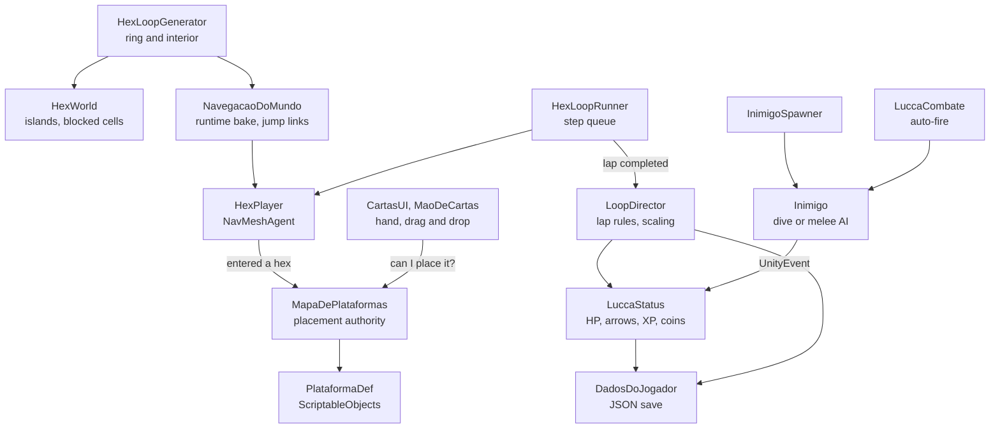
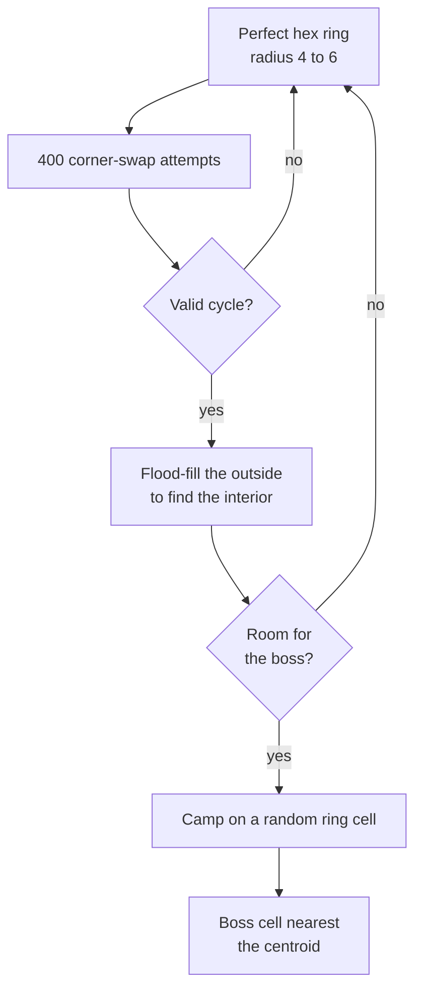

# Loopia

**English** · **[Português (Brasil)](README.pt-BR.md)**

**A loop-based strategy prototype in Unity 6. The hero runs a procedurally generated hexagonal ring on his own while the player shapes the world with island cards.**

Loopia is a student team project built from a game design document (GDD). Lucca, the hero, walks a closed ring of islands and fights automatically; the player never controls him directly. Instead, the player drags island cards onto the map to heal him, arm him, make him stronger or spawn enemies worth XP. Every lap he completes heals him and makes the enemies stronger. This README covers the technical side: the stack, the architecture and the logic behind each system.

## Contents

- [Team](#team)
- [Tech stack](#tech-stack)
- [Architecture](#architecture)
- [Systems](#systems)
- [Engineering notes](#engineering-notes)
- [Validation](#validation)
- [Project layout](#project-layout)
- [Getting started](#getting-started)
- [Status and limitations](#status-and-limitations)

## Team

| Member | Areas |
|---|---|
| [@Sitr3n01](https://github.com/Sitr3n01) (José Gilberto) | All gameplay programming in `Assets/Scripts/Hex`: world generation, navigation, loop rules, cards, combat, enemy AI, save system, camera and scenery scripts |
| [@Matt040205](https://github.com/Matt040205) | 3D models and textures |
| [@amigolindu](https://github.com/amigolindu) | Scenery, shaders, water, day and night cycle, VFX |

> **How the code was developed.** José broke the GDD down into requirements, designed the architecture and implemented it with an AI-assisted workflow: LLM coding agents that he directed and reviewed, with changes validated in the Unity Editor (see [Validation](#validation)). Because of that setup, the code commits in this repository are authored as `Bionic Assistant`.

## Tech stack

Versions come from `ProjectSettings/ProjectVersion.txt` and `Packages/packages-lock.json`.

| Area | Technology |
|---|---|
| Engine | Unity 6.3 LTS (`6000.3.10f1`), Universal Render Pipeline 17.3 |
| Language | C#; all current gameplay code is in the `Loopia.Hex` namespace |
| Navigation | AI Navigation 2.0.6: `NavMeshSurface` baked at runtime, `NavMeshLink`, a custom agent type |
| Input | Input System 1.13.1, with a fallback to the legacy Input Manager (`#if ENABLE_INPUT_SYSTEM`) |
| Data | ScriptableObjects for cards and enemies, JSON save through `JsonUtility` |
| Rendering and VFX | URP, VFX Graph 17.3 (death smoke), Shader Graph (water) |
| UI | IMGUI for the prototype HUD and card bar; uGUI and TextMeshPro for the camp and death screens |
| Tooling | MCP for Unity, used to validate changes inside the Editor |

## Architecture

Components get Inspector references or find each other in `Start`, then talk through C# events: `AoGerarMapa`, `AoEntrarNoHexagono`, `AoCompletarVolta`, `AoSubirDeNivel` and `AoMorrer`. Anything a designer should be able to rewire, such as enemy attacks and the game over screen, goes through a `UnityEvent` set up in the Inspector. Script execution order makes the startup deterministic: the generator builds the map in `Awake` (order -150), navigation bakes it (order -100), and everything else starts after that.

## Systems

### Hex grid

- [`HexCoord`](Assets/Scripts/Hex/HexCoord.cs) uses axial coordinates (q, r) for pointy-top hexes, with the cube coordinate derived as s = −q − r.
  - Distance is (|dq| + |dr| + |ds|) / 2.
  - Mouse picking uses cube rounding: round all three axes, then fix the one with the largest error.
- `HexLayout` converts axial coordinates to world XZ and back, and `HexMesh` generates the extruded hex slab.
- The grid has no bounds. It's pure math, and only islands exist as objects. Each cell is in one of three states: island, free, or blocked (the ring's interior, reserved for the boss).

### Procedural ring

[`HexLoopGenerator`](Assets/Scripts/Hex/HexLoopGenerator.cs) draws a new ring every run: a closed path one hex wide whose shape can come out round, square-ish or irregular, always with room for the boss in the middle.

- **Starting ring.** A perfect hex ring of radius 4 to 6 has 6R cells (24 to 36) and is already a valid cycle. Swaps keep the cell count.
- **Corner swap.** Cell B sits between A and C on the path. B can only be replaced by the other common neighbour of A and C, and only if that cell touches no path cell besides A and C. Every cell keeps exactly two path neighbours, so the ring can get as irregular as the attempts allow without crossing itself or breaking apart.
- **Interior.** Found by elimination: a flood fill starts outside, on the border of a bounding box padded by three cells, and whatever it can't reach, and isn't on the ring, is enclosed.
- **Boss room.** The interior needs at least nine cells, and at least one of them must have all six neighbours inside the interior too. That's the hex equivalent of a 3×3 block.
- **Validity check.** `CicloEhValido` checks the result: the cycle is closed, no cell repeats, each cell neighbours the next, and no cell has more than two path neighbours (that would be a shortcut).
- **Retries and seed.** Generation retries up to 40 times. An optional fixed seed reproduces a map for tests.

### World and navigation

- **Runtime bake.** Islands are created at runtime, so [`NavegacaoDoMundo`](Assets/Scripts/Hex/NavegacaoDoMundo.cs) bakes a `NavMeshSurface` after every new map.
- **Jump links.** A gap separates the islands, so each one becomes its own piece of NavMesh. Each pair of consecutive islands gets one bidirectional `NavMeshLink` in the Jump area. It runs from edge to edge: the hex apothem minus the agent radius and a safety margin.
- **Movement.** [`HexPlayer`](Assets/Scripts/Hex/HexPlayer.cs) crosses the links in an animated arc, following the pattern of Unity's AgentLinkMover sample: the position is driven by hand during the link, then `CompleteOffMeshLink`. It takes orders as a queue of hexes. `HexLoopRunner` keeps three steps queued, so Lucca never stops between islands.
- **Custom agent type.** Lucca uses an agent type of radius 0.2. With the default Humanoid (radius 0.5, minimum region area 2 m²), the bake discarded the small islands.
- **Wolves stay home.** Wolves use an area mask without the Jump area, so they chase Lucca inside their own island and never follow him across.
- **Height changes.** When a card raises an island, the NavMesh is rebaked, living enemies snap to the new terrain and the camera reframes the ring.

### Loop rules

[`LoopDirector`](Assets/Scripts/Hex/LoopDirector.cs) applies the rules that trigger when a lap closes at the camp:

- Lucca gets back his full HP and arrows. The restore does nothing if he is already dead, so a death on the camp tile can't be undone in the same frame.
- Enemies get +10% HP, attack and XP per lap, compounded (the multiplier is multiplied by 1.1 each lap). New enemies spawn with the current multiplier.
- The best lap count is saved.
- After four laps, the boss event fires.

### Cards and platforms

[`PlataformaDef`](Assets/Scripts/Hex/PlataformaDef.cs) is an abstract ScriptableObject. Each card type is a small subclass that overrides hooks (`AoColocar`, `AoPlayerPassar`, `AoFecharVolta`, `AoRemover`, `BonusDePv`, `BonusDeDano`, `DisponivelParaCompra`), so adding a card never means growing a switch statement. The 11 cards in `Assets/Dados/Plataformas`:

| Card | Class | Goes on | Effect |
|---|---|---|---|
| Basic | `PlataformaSimplesDef` | Path | None; it exists to be replaced |
| Peaceful Field | `PlataformaSimplesDef` | Off path | +2 max HP |
| Tower | `PlataformaSimplesDef` | Off path | +8% arrow damage |
| Cabin | `PlataformaVizinhancaDef` | Off path | +2 max HP, +2 per adjacent Peaceful Field |
| Training Area | `PlataformaVizinhancaDef` | Off path | +8% damage, +15% per adjacent Tower |
| Heart | `PlataformaRecompensaDef` | Path | +5 HP when Lucca passes; recharges every lap |
| Arrows | `PlataformaRecompensaDef` | Path | +10 arrows, recharges every lap |
| Coins | `PlataformaRecompensaDef` | Path | +3 coins, recharges every lap |
| Forest | `PlataformaFlorestaDef` | Path | Keeps a wolf on its cell, topped up every lap instead of stacking |
| Spring | `PlataformaMolaDef` | Path | Charges 3 units of jump impulse |
| High island | `PlataformaRelevoDef` | Path | Raises the island 2.2 units; only offered once a Spring is on the map |

- **Neighbourhood bonuses.** The GDD describes neighbourhoods as 3×3 and 5×5 areas, written with a square grid in mind. On hexes that becomes a radius of 1 (the 6 neighbours) or 2 (the 18 around).
- **Placement authority.** [`MapaDePlataformas`](Assets/Scripts/Hex/MapaDePlataformas.cs) is the only place that decides whether a card can go somewhere. `PodeColocar` returns a reason string that the UI shows. It covers:
  - path and off-path rules;
  - the camp, which can't be replaced;
  - the boss interior;
  - cards that can't be replaced;
  - waiting while Lucca stands on or jumps toward the island being changed.
- **Lap simulation.** Before accepting a card, the map simulates a full lap, both from the camp and from Lucca's current position with the impulse he carries. It rejects any layout that would require a climb higher than a normal jump (0.7) without a Spring before it.
- **Bonuses.** Bonuses are recomputed after every change, since a Cabin's bonus depends on what's around it. A higher max HP also raises current HP.
- **Hand.** The hand has 4 slots, filled from guaranteed starting cards plus uniform draws from the deck. Each level-up adds a card, and a card offered "on unlock" (the High island) shows up once its condition is met. The placement grid only appears while a card is dragged, with a green or red marker and the refusal reason.

### Combat and enemies

- **Auto-combat** ([`LuccaCombate`](Assets/Scripts/Hex/LuccaCombate.cs)).
  - Lucca never stops to fight. He shoots the closest enemy within 3 hexes that is in front of him (dot product) or on his own hex, one arrow every 0.8 s.
  - Without arrows he keeps walking and starts shooting again as soon as he picks some up.
  - Damage is attack × (1 + the platforms' damage bonus).
- **Enemies as data.** `InimigoDef` assets hold the GDD numbers:

  | Enemy | HP | Attack | XP | Attack interval | Reach |
  |---|---|---|---|---|---|
  | Bat | 50 | 5 | 50 | 1.6 s | 2 hexes |
  | Wolf | 100 | 15 | 100 | 2.2 s | Same hex |

- **Bat.** Spawns on a random path cell every 5 s, up to 6 alive, at least 3 hexes from Lucca. Its behaviour is a state machine with three states: perched, diving, returning. It dives when Lucca comes within reach, deals damage only if it gets close enough before the dive times out (1.2 s), then flies back to its perch.
- **Wolf.** Uses the NavMesh to chase Lucca inside its own island, with a detection radius and a melee range, and goes back when he leaves.
- **Decoupling.** Enemies never reference the player. An attack leaves through `Inimigo.aoAtacar`, goes to `InimigoSpawner.aoInimigoAtacar`, and reaches `LuccaStatus.ReceberDano`, all wired in the Inspector.
- **Progression.** The first level costs 100 XP and each next one costs 75% more (×1.75). A `while` loop handles a kill worth more than one level.

### Save and scenes

- **Save.** [`DadosDoJogador`](Assets/Scripts/Hex/DadosDoJogador.cs) is a singleton that creates itself on demand and survives scene loads. It keeps the total coins and the lap record in a JSON file under `Application.persistentDataPath`. A corrupt file resets to defaults instead of blocking the game.
- **Coins.** Path islands have a 20% chance to get a coin at the start and on every lap.
- **Scenes.** `Acampamento` is the hub: it shows totals and the record and starts a new run. `HexPrototipo` is the game. The death screen goes back to the camp, and the build starts at `Acampamento`.

### Presentation

- **Camera.** Orthographic and isometric (30° pitch, 45° yaw). It frames the whole ring automatically from the bounds of the models and terrain.
- **Background.** The background and water scale with the camera projection, so the four screen corners stay covered at any zoom and aspect ratio.
- **Decorations.** Placed by coordinate on each island's edge. The centre and the six corridors stay free for cards, and decorations are kept out of the NavMesh bake.
- **Clouds.** A cloud layer under the islands recycles volumes only when they are off screen, blended with the fog.
- **Death smoke.** A VFX Graph effect that stops emitting after 0.18 s and is removed after 5 s.

## Engineering notes

- **Cards lost their scripts after reopening the project.**
  - **Symptom:** six of nine card assets ended up with `m_Script: {fileID: 0}`. They worked while loaded in memory and turned null when Unity restarted.
  - **Cause:** four platform classes shared one `.cs` file, and Unity binds each script file to a single class.
  - **Fix:** each class got its own file, and the cards were re-pointed without losing their serialized values.
- **The bake dropped the islands.** The default Humanoid agent was too big for the small islands, so the bake discarded them. A dedicated agent type with radius 0.2 fixed it.
- **Link teardown timing.** `Destroy` only runs at the end of the frame, so old links are disabled first. That removes them from the NavMesh immediately, before the rebake.
- **Scene merge.** A teammate's lighting changes and the gameplay changes touched the same scene. Instead of merging the scene YAML by hand, their version was kept and the gameplay changes were re-applied through the Unity Editor.
- **Ambiguous design numbers.** Where the GDD was ambiguous, the code picks one reading and says so in an Inspector tooltip so the team can confirm it. For example, "75% of the previous value" for the XP curve was read as ×1.75.

## Validation

The design requirements were validated in Play Mode through the Unity Editor, documented in [docs/Exigencias_Ze_Validacao.md](docs/Exigencias_Ze_Validacao.md) (Portuguese) with captures in [`Captures/`](Captures):

| Check | Result |
|---|---|
| Compilation and console | No errors or warnings; 13 new prefabs with no missing scripts or materials |
| Map generation | Maps of 24, 36 and 60 islands generated successfully |
| Decorations, seeds 177, 179 and 183 | 88, 126 and 208 decorations; no intrusions into the centre or corridors, no overlaps |
| Background coverage | All four corners inside the water in 16:9, 4:3 and 9:16, at all three map sizes (9 of 9) |
| Terrain rules | Card blocked without a Spring and unlocked with one; second climb without a recharge refused; jump with impulse reached the high island and used up the charge |
| Automatic lap | A full lap over a real Spring and a high island, with no height block |
| Rewards | Heal +5, coins +3 and arrows up to the cap; no repeated pickup in the same lap; visuals restored when the lap closes |
| Wolf AI | Closed in to about 0.57 units and dealt damage; at about 9.05 units it went back without dealing damage |
| Death smoke | Two effects visible after killing a wolf and a bat; none left after the cleanup delay |

These checks don't replace difficulty tuning or a balancing playtest.

## Project layout

| Path | Contents |
|---|---|
| `Assets/Scripts/Hex/` | Current game code: `Loopia.Hex` namespace, 43 files, about 5.6k lines |
| `Assets/Dados/` | Card (`PlataformaDef`) and enemy (`InimigoDef`) assets |
| `Assets/Scenes/` | `Acampamento` and `HexPrototipo`, plus the scenes of the first prototype |
| `Assets/Scripts/{Loop, Player, Plataformas, Inimigo, Manager, UI}` | First prototype, from the initial import. Still referenced by the `Testes`, `Menu`, `GameOver` and `Win` scenes; not used by the current game. |
| `Assets/VFX e Shaders/`, `Assets/testes shaders/` | Shaders and VFX |
| `docs/` | Requirements analysis and validation report |
| `Captures/` | Play Mode captures from the validation |

## Getting started

1. Open the project with Unity `6000.3.10f1`.
2. Open `Assets/Scenes/Acampamento.unity` (the first scene in the build) and press Play, or open `Assets/Scenes/HexPrototipo.unity` directly.
3. The starting hand has Spring, Heart, Coins and Arrows. Drag the Spring onto a path island before the stretch you want to climb. The High island card is then offered once; place it after the Spring, in the direction Lucca runs. The UI explains any refused placement.
4. Use the Forest card to see the wolf AI. Speeds, ranges and heights are exposed in the Inspector for balancing.

## Status and limitations

Loopia is a prototype:

- 11 card types are implemented; the GDD lists 17 platforms.
- After four laps the boss event fires, but the boss itself isn't implemented yet.
- The HUD and card bar are IMGUI placeholders.
- Validation is done by hand in Play Mode; there is no automated test suite yet.
