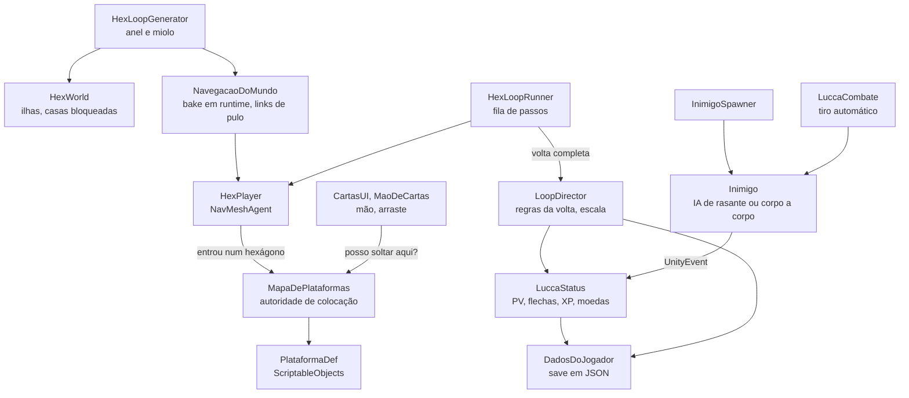
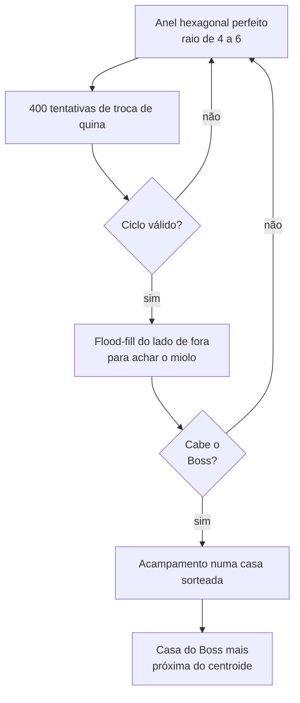

# Loopia

**[English](README.md)** · **Português (Brasil)**

**Protótipo de estratégia em loop feito em Unity 6. O herói percorre sozinho um anel hexagonal gerado proceduralmente, enquanto o jogador molda o mundo com cartas de ilha.**

O Loopia é um projeto de equipe acadêmico feito a partir de um documento de game design (GDD). Lucca, o herói, anda num anel fechado de ilhas e luta sozinho; o jogador nunca o controla diretamente. Em vez disso, arrasta cartas de ilha para o mapa para curá-lo, dar munição a ele, deixá-lo mais forte ou gerar inimigos que valem XP. A cada volta completa, Lucca se recupera e os inimigos ficam mais fortes. Este README cobre a parte técnica: a stack, a arquitetura e a lógica de cada sistema.

## Sumário

- [Equipe](#equipe)
- [Stack técnica](#stack-técnica)
- [Arquitetura](#arquitetura)
- [Sistemas](#sistemas)
- [Notas de engenharia](#notas-de-engenharia)
- [Validação](#validação)
- [Estrutura do projeto](#estrutura-do-projeto)
- [Como rodar](#como-rodar)
- [Status e limitações](#status-e-limitações)

## Equipe

| Integrante | Áreas |
|---|---|
| [@Sitr3n01](https://github.com/Sitr3n01) (José Gilberto) | Toda a programação de gameplay em `Assets/Scripts/Hex`: geração do mundo, navegação, regras do loop, cartas, combate, IA dos inimigos, save, scripts de câmera e de cenário |
| [@Matt040205](https://github.com/Matt040205) | Modelos 3D e texturas |
| [@amigolindu](https://github.com/amigolindu) | Cenário, shaders, água, ciclo dia e noite, VFX |

> **Como o código foi desenvolvido.** José quebrou o GDD em requisitos, desenhou a arquitetura e implementou tudo com um fluxo assistido por IA: agentes de código baseados em LLM, dirigidos e revisados por ele, com as mudanças validadas no Unity Editor (ver [Validação](#validação)). Por causa desse fluxo, os commits de código deste repositório aparecem com o autor `Bionic Assistant`.

## Stack técnica

As versões vêm de `ProjectSettings/ProjectVersion.txt` e `Packages/packages-lock.json`.

| Área | Tecnologia |
|---|---|
| Engine | Unity 6.3 LTS (`6000.3.10f1`), Universal Render Pipeline 17.3 |
| Linguagem | C#; todo o código de gameplay atual fica no namespace `Loopia.Hex` |
| Navegação | AI Navigation 2.0.6: `NavMeshSurface` assado em tempo de jogo, `NavMeshLink`, um tipo de agente próprio |
| Input | Input System 1.13.1, com fallback para o Input Manager antigo (`#if ENABLE_INPUT_SYSTEM`) |
| Dados | ScriptableObjects para cartas e inimigos, save em JSON via `JsonUtility` |
| Renderização e VFX | URP, VFX Graph 17.3 (fumaça de morte), Shader Graph (água) |
| UI | IMGUI na HUD e na barra de cartas do protótipo; uGUI e TextMeshPro nas telas de acampamento e de morte |
| Ferramentas | MCP for Unity, usado para validar mudanças dentro do Editor |

## Arquitetura

Os componentes recebem referências pelo Inspector ou se encontram no `Start` e depois conversam por eventos C#: `AoGerarMapa`, `AoEntrarNoHexagono`, `AoCompletarVolta`, `AoSubirDeNivel` e `AoMorrer`. O que o designer precisa poder religar, como o ataque dos inimigos e a tela de game over, passa por um `UnityEvent` configurado no Inspector. A ordem de execução torna a inicialização determinística: o gerador monta o mapa no `Awake` (ordem -150), a navegação faz o bake (ordem -100) e o resto começa depois.

## Sistemas

### Grade hexagonal

- O [`HexCoord`](Assets/Scripts/Hex/HexCoord.cs) usa coordenadas axiais (q, r) para hexágonos pointy-top, com a coordenada cúbica derivada como s = −q − r.
  - A distância é (|dq| + |dr| + |ds|) / 2.
  - A seleção pelo mouse usa arredondamento cúbico: arredonda os três eixos e corrige o que tiver o maior erro.
- O `HexLayout` converte coordenadas axiais para o plano XZ do mundo e de volta, e o `HexMesh` gera a laje hexagonal extrudada.
- A grade não tem borda: é só matemática, e apenas as ilhas existem como objetos. Cada casa está num de três estados: com ilha, livre, ou bloqueada (o miolo do anel, reservado ao Boss).

### Anel procedural

O [`HexLoopGenerator`](Assets/Scripts/Hex/HexLoopGenerator.cs) sorteia um anel novo a cada partida: um caminho fechado de um hexágono de largura, que pode sair redondo, meio quadrado ou irregular, sempre com espaço para o Boss no meio.

- **Anel inicial.** Um anel hexagonal perfeito de raio 4 a 6 tem 6R casas (24 a 36) e já é um ciclo válido. As trocas mantêm o número de casas.
- **Troca de quina.** A casa B fica entre A e C no caminho. B só pode ser trocada pela outra vizinha comum de A e C, e só se essa casa não encostar em nenhuma casa do caminho além de A e C. Toda casa continua com exatamente duas vizinhas no caminho, então o anel pode ficar tão irregular quanto as tentativas permitirem sem se cruzar nem se partir.
- **Miolo.** Encontrado por eliminação: uma inundação começa do lado de fora, na borda de uma caixa com folga de três casas, e o que ela não alcança, e não faz parte do anel, está cercado.
- **Espaço do Boss.** O miolo precisa de pelo menos nove casas, e pelo menos uma delas precisa ter as seis vizinhas também no miolo. É o equivalente hexagonal de um bloco 3×3.
- **Conferência.** O `CicloEhValido` confere o resultado: o ciclo é fechado, nenhuma casa se repete, cada casa é vizinha da seguinte e nenhuma tem mais de duas vizinhas no caminho (isso seria um atalho).
- **Tentativas e semente.** A geração tenta até 40 vezes. Uma semente fixa opcional reproduz o mesmo mapa nos testes.

### Mundo e navegação

- **Bake em tempo de jogo.** As ilhas são criadas em tempo de jogo, então o [`NavegacaoDoMundo`](Assets/Scripts/Hex/NavegacaoDoMundo.cs) assa um `NavMeshSurface` depois de cada mapa novo.
- **Links de pulo.** Um vão separa as ilhas, então cada uma vira um pedaço isolado de NavMesh. Cada par de ilhas consecutivas ganha um `NavMeshLink` bidirecional na área Jump, de beirada a beirada: o apótema do hexágono menos o raio do agente e uma margem de segurança.
- **Movimento.** O [`HexPlayer`](Assets/Scripts/Hex/HexPlayer.cs) atravessa os links num arco animado, seguindo o padrão do exemplo AgentLinkMover da Unity: posição controlada à mão durante o link, depois `CompleteOffMeshLink`. Ele recebe ordens como uma fila de hexágonos. O `HexLoopRunner` mantém três passos na fila, então o Lucca nunca para entre uma ilha e outra.
- **Tipo de agente próprio.** O Lucca usa um tipo de agente de raio 0,2. Com o Humanoid padrão (raio 0,5 e área mínima de 2 m²), o bake descartava as ilhas pequenas.
- **Lobos em casa.** Os lobos usam uma máscara de área sem a Jump, então perseguem o Lucca dentro da própria ilha e nunca o seguem pelo pulo.
- **Mudança de altura.** Quando uma carta eleva uma ilha, o NavMesh é refeito, os inimigos vivos se ajustam ao novo relevo e a câmera reenquadra o anel.

### Regras do loop

O [`LoopDirector`](Assets/Scripts/Hex/LoopDirector.cs) aplica as regras de quando uma volta fecha no acampamento:

- O Lucca recupera toda a vida e as flechas. A recuperação não faz nada se ele já estiver morto, então uma morte em cima do acampamento não é desfeita no mesmo frame.
- Os inimigos ganham +10% de PV, ataque e XP por volta, de forma composta (o multiplicador é multiplicado por 1,1 a cada volta). Inimigos novos já nascem com o multiplicador atual.
- O recorde de voltas é salvo.
- Depois de quatro voltas, o evento do Boss é disparado.

### Cartas e plataformas

O [`PlataformaDef`](Assets/Scripts/Hex/PlataformaDef.cs) é um ScriptableObject abstrato. Cada tipo de carta é uma subclasse pequena que sobrescreve ganchos (`AoColocar`, `AoPlayerPassar`, `AoFecharVolta`, `AoRemover`, `BonusDePv`, `BonusDeDano`, `DisponivelParaCompra`), então uma carta nova nunca engorda um switch. As 11 cartas em `Assets/Dados/Plataformas`:

| Carta | Classe | Onde vai | Efeito |
|---|---|---|---|
| Básica | `PlataformaSimplesDef` | Caminho | Nenhum; existe para ser substituída |
| Campo Pacífico | `PlataformaSimplesDef` | Fora do caminho | +2 de PV máximo |
| Torre | `PlataformaSimplesDef` | Fora do caminho | +8% de dano das flechas |
| Cabana | `PlataformaVizinhancaDef` | Fora do caminho | +2 de PV máximo, +2 por Campo Pacífico vizinho |
| Área de Treino | `PlataformaVizinhancaDef` | Fora do caminho | +8% de dano, +15% por Torre vizinha |
| Coração | `PlataformaRecompensaDef` | Caminho | +5 de PV quando o Lucca passa; recarrega a cada volta |
| Flechas | `PlataformaRecompensaDef` | Caminho | +10 flechas, recarrega a cada volta |
| Moedas | `PlataformaRecompensaDef` | Caminho | +3 moedas, recarrega a cada volta |
| Floresta | `PlataformaFlorestaDef` | Caminho | Mantém um lobo na casa, reposto a cada volta em vez de acumular |
| Mola | `PlataformaMolaDef` | Caminho | Carrega 3 unidades de impulso de pulo |
| Ilha alta | `PlataformaRelevoDef` | Caminho | Eleva a ilha em 2,2 unidades; só é oferecida quando existe uma Mola no mapa |

- **Bônus de vizinhança.** O GDD descreve vizinhança como áreas 3×3 e 5×5, pensando em grade quadrada. No hexágono isso vira raio 1 (as 6 vizinhas) ou 2 (as 18 em volta).
- **Autoridade de colocação.** O [`MapaDePlataformas`](Assets/Scripts/Hex/MapaDePlataformas.cs) é o único que decide se uma carta pode ir para um lugar. O `PodeColocar` devolve um texto com o motivo, que a UI mostra. Ele cobre:
  - as regras de caminho e de fora do caminho;
  - o acampamento, que não pode ser substituído;
  - o miolo do Boss;
  - as cartas que não podem ser substituídas;
  - a espera enquanto o Lucca está na ilha alterada ou pulando para ela.
- **Simulação de volta.** Antes de aceitar uma carta, o mapa simula uma volta inteira, tanto a partir do acampamento quanto da posição atual do Lucca com o impulso que ele carrega. Ele recusa qualquer arranjo que exija uma subida maior que o pulo normal (0,7) sem uma Mola antes.
- **Bônus.** Os bônus são recalculados a cada mudança, porque o bônus da Cabana depende do que está em volta. Um PV máximo maior também aumenta o PV atual.
- **Mão.** A mão tem 4 espaços, preenchidos com cartas iniciais garantidas e sorteios uniformes do baralho. Cada nível novo traz uma carta, e uma carta oferecida "ao liberar" (a Ilha alta) aparece uma vez quando a condição dela é cumprida. A grade de colocação só aparece enquanto a carta é arrastada, com um marcador verde ou vermelho e o motivo da recusa.

### Combate e inimigos

- **Combate automático** ([`LuccaCombate`](Assets/Scripts/Hex/LuccaCombate.cs)).
  - O Lucca nunca para para lutar. Ele atira no inimigo mais próximo a até 3 hexágonos que esteja à frente dele (produto escalar) ou na mesma casa, uma flecha a cada 0,8 s.
  - Sem flechas, ele segue andando e volta a atirar assim que pega mais.
  - O dano é ataque × (1 + o bônus de dano das plataformas).
- **Inimigos como dados.** Assets `InimigoDef` guardam os números do GDD:

  | Inimigo | PV | Ataque | XP | Intervalo de ataque | Alcance |
  |---|---|---|---|---|---|
  | Morcego | 50 | 5 | 50 | 1,6 s | 2 hexágonos |
  | Lobo | 100 | 15 | 100 | 2,2 s | Mesma casa |

- **Morcego.** Nasce numa casa sorteada do caminho a cada 5 s, até 6 vivos, a pelo menos 3 hexágonos do Lucca. O comportamento é uma máquina de estados com três estados: pousado, mergulhando, voltando. Ele mergulha quando o Lucca entra no alcance, só causa dano se chegar perto o bastante antes do tempo do mergulho acabar (1,2 s), e depois volta para o poleiro.
- **Lobo.** Usa o NavMesh para perseguir o Lucca dentro da própria ilha, com raio de detecção e alcance corpo a corpo, e volta quando ele sai.
- **Desacoplamento.** Os inimigos nunca referenciam o jogador. Um ataque sai por `Inimigo.aoAtacar`, passa por `InimigoSpawner.aoInimigoAtacar` e chega a `LuccaStatus.ReceberDano`, tudo ligado no Inspector.
- **Progressão.** O primeiro nível custa 100 XP e cada nível seguinte custa 75% a mais (×1,75). Um `while` trata o caso de um abate valer mais de um nível.

### Save e cenas

- **Save.** O [`DadosDoJogador`](Assets/Scripts/Hex/DadosDoJogador.cs) é um singleton que se cria sozinho quando é pedido e atravessa as cenas. Ele guarda o total de moedas e o recorde de voltas num JSON em `Application.persistentDataPath`. Um arquivo corrompido volta aos valores padrão em vez de travar o jogo.
- **Moedas.** As ilhas do caminho têm 20% de chance de ganhar uma moeda no início e a cada volta.
- **Cenas.** O `Acampamento` é o hub: mostra os totais e o recorde e começa uma nova jornada. O `HexPrototipo` é o jogo. A tela de morte leva de volta ao acampamento, e a build começa pelo `Acampamento`.

### Apresentação

- **Câmera.** Ortográfica e isométrica (inclinação de 30°, giro de 45°). Enquadra o anel inteiro automaticamente a partir dos limites dos modelos e do relevo.
- **Fundo.** O fundo e a água acompanham a projeção da câmera, então os quatro cantos da tela ficam cobertos em qualquer zoom e proporção.
- **Decorações.** Posicionadas por coordenada na periferia de cada ilha. O centro e os seis corredores ficam livres para as cartas, e as decorações ficam fora do bake do NavMesh.
- **Nuvens.** Uma camada de nuvens abaixo das ilhas recicla volumes só quando eles estão fora da tela, integrada à neblina.
- **Fumaça de morte.** Um efeito de VFX Graph que para de emitir depois de 0,18 s e é removido depois de 5 s.

## Notas de engenharia

- **As cartas perdiam o script ao reabrir o projeto.**
  - **Sintoma:** seis de nove assets de carta ficaram com `m_Script: {fileID: 0}`. Funcionavam enquanto estavam na memória e viravam nulas quando a Unity reabria.
  - **Causa:** quatro classes de plataforma dividiam um mesmo `.cs`, e a Unity liga cada arquivo de script a uma única classe.
  - **Correção:** cada classe ganhou o próprio arquivo, e as cartas foram reapontadas sem perder os valores serializados.
- **O bake descartava as ilhas.** O agente Humanoid padrão era grande demais para as ilhas pequenas, e o bake as descartava. Um tipo de agente dedicado, de raio 0,2, resolveu.
- **Momento de destruir os links.** O `Destroy` só acontece no fim do frame, então os links antigos são desligados antes. Isso os tira do NavMesh na hora, antes do novo bake.
- **Merge de cena.** As mudanças de iluminação de um colega e as de gameplay mexiam na mesma cena. Em vez de mesclar o YAML da cena à mão, a versão dele foi mantida e as mudanças de gameplay foram reaplicadas pelo próprio Unity Editor.
- **Números ambíguos do design.** Onde o GDD era ambíguo, o código escolhe uma leitura e registra isso num tooltip do Inspector para o time confirmar. Por exemplo, "75% do valor passado" na curva de XP foi lido como ×1,75.

## Validação

As exigências de design foram validadas em Play Mode pelo Unity Editor, com registro em [docs/Exigencias_Ze_Validacao.md](docs/Exigencias_Ze_Validacao.md) e capturas em [`Captures/`](Captures):

| Verificação | Resultado |
|---|---|
| Compilação e Console | Sem erros nem avisos; 13 prefabs novos sem scripts ou materiais ausentes |
| Geração de mapas | Mapas de 24, 36 e 60 ilhas gerados com sucesso |
| Decorações, sementes 177, 179 e 183 | 88, 126 e 208 decorações; nenhuma invasão do centro ou dos corredores, nenhuma sobreposição |
| Cobertura do fundo | Os quatro cantos dentro da água em 16:9, 4:3 e 9:16, nos três tamanhos de mapa (9 de 9) |
| Regras de relevo | Carta bloqueada sem Mola e liberada com ela; segunda subida sem recarga recusada; pulo com impulso chegou à ilha alta e consumiu a carga |
| Volta automática | Uma volta completa passando por uma Mola real e por uma ilha alta, sem bloqueio por altura |
| Recompensas | Cura +5, moedas +3 e flechas até o limite; sem coleta repetida na mesma volta; visual restaurado ao fechar a volta |
| IA do lobo | Chegou a cerca de 0,57 unidade e causou dano; a cerca de 9,05 unidades voltou sem causar dano |
| Fumaça de morte | Dois efeitos visíveis depois de matar um lobo e um morcego; nenhum restante depois do prazo de limpeza |

Essas verificações não substituem o ajuste de dificuldade nem um playtest de balanceamento.

## Estrutura do projeto

| Caminho | Conteúdo |
|---|---|
| `Assets/Scripts/Hex/` | Código atual do jogo: namespace `Loopia.Hex`, 43 arquivos, cerca de 5,6 mil linhas |
| `Assets/Dados/` | Assets das cartas (`PlataformaDef`) e dos inimigos (`InimigoDef`) |
| `Assets/Scenes/` | `Acampamento` e `HexPrototipo`, mais as cenas do primeiro protótipo |
| `Assets/Scripts/{Loop, Player, Plataformas, Inimigo, Manager, UI}` | Primeiro protótipo, da importação inicial. Ainda é usado pelas cenas `Testes`, `Menu`, `GameOver` e `Win`; não é usado pelo jogo atual. |
| `Assets/VFX e Shaders/`, `Assets/testes shaders/` | Shaders e VFX |
| `docs/` | Análise de requisitos e relatório de validação |
| `Captures/` | Capturas de Play Mode feitas na validação |

## Como rodar

1. Abra o projeto com a Unity `6000.3.10f1`.
2. Abra `Assets/Scenes/Acampamento.unity` (a primeira cena da build) e dê Play, ou abra direto `Assets/Scenes/HexPrototipo.unity`.
3. A mão inicial tem Mola, Coração, Moedas e Flechas. Arraste a Mola para uma ilha do caminho antes do trecho em que quer subir. A carta Ilha alta passa a ser oferecida uma vez; coloque-a depois da Mola, no sentido em que o Lucca corre. A UI explica qualquer colocação recusada.
4. Use a carta Floresta para ver a IA dos lobos. Velocidades, alcances e alturas ficam expostos no Inspector para balanceamento.

## Status e limitações

O Loopia é um protótipo:

- 11 tipos de carta estão implementados; o GDD lista 17 plataformas.
- Depois de quatro voltas o evento do Boss é disparado, mas o Boss em si ainda não foi implementado.
- A HUD e a barra de cartas são placeholders em IMGUI.
- A validação é feita à mão em Play Mode; ainda não existe uma suíte de testes automatizados.
